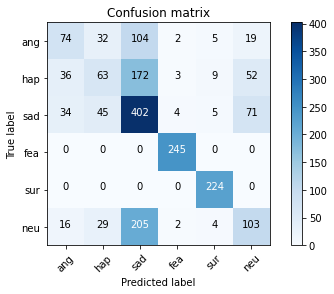

(7837, 10) (1960, 10)

{0: 905, 1: 1312, 2: 2336, 3: 981, 4: 943, 5: 1360}

'ang': 0, 905
'hap': 1, 1312
'sad': 2, 2336
'fea': 3, 981    (*30)
'sur': 4, 943    (*10)
'neu': 5, 1360

'ang': 0, 905
'hap': 1, 1312 + 943 = 2255
'sad': 2, 2336
'neu': 3, 1360

### Features Selection

    sig_mean
    sig_std
    rmse_mean
    rmse_std
    silence
    harmonic
    pitch_mean
    pitch_std
    gender (option)

### Gender effect

- XGBoost(gender)
    Test Set Accuracy =  0.566
    Test Set F-score =  0.572
    Test Set Precision =  0.598
    Test Set Recall =  0.574
    Confusion matrix, without normalization
    [[ 60  25 108   0   0  13]
     [ 36  65 173   0   8  51]
     [ 41  48 406   3   8  78]
     [  0   0   0 256   0   0]
     [  0   0   7   0 219   0]
     [ 17  23 211   0   0 104]]
 
- XGBoost(non-gender) 
    Test Set Accuracy =  0.567
    Test Set F-score =  0.575
    Test Set Precision =  0.596
    Test Set Recall =  0.584
    Confusion matrix, without normalization
    [[ 74  32 104   2   5  19]
     [ 36  63 172   3   9  52]
     [ 34  45 402   4   5  71]
     [  0   0   0 245   0   0]
     [  0   0   0   0 224   0]
     [ 16  29 205   2   4 103]]
    
    
 
- rf (gender)
    Test Set Accuracy =  0.581
    Test Set F-score =  0.584
    Test Set Precision =  0.613
    Test Set Recall =  0.590
    Confusion matrix, without normalization
        
    Test Set Accuracy =  0.571
    Test Set F-score =  0.575
    Test Set Precision =  0.604
    Test Set Recall =  0.585
    Confusion matrix, without normalization
 
- ensemble(gender)
    
    Test Set Accuracy =  0.575
    Test Set F-score =  0.575
    Test Set Precision =  0.601
    Test Set Recall =  0.585
    Confusion matrix, without normalization
    
    Test Set Accuracy =  0.569
    Test Set F-score =  0.568
    Test Set Precision =  0.601
    Test Set Recall =  0.581
    Confusion matrix, without normalization
 
 - summary
    - recall of fea and sur is 100%
    - recall ranking : fea/sur(100%) > sad > neu > hap(0.5) > angy(0.5)
    - Predict as sad overwhelm than do as others, precision is 0.5
  

# Verify IEMOCAP pre-trained SER in blizzard13
    - Extract Character sentence, by quotation marks
        - "grep -iRo "“.*”" jane_eyre.txt
    - Predict and Ranking the accuracy
    - Anotate the top 20 for each category
    - Evaluate by F-score / Precision and Recall 

# Algorithm UP!
    - Using features of salient audio slices, instead of whole
        - salient audio slices can be used in Local style token(LST) as salient local style(SLS).
            - Example
                GST: 33333333333
                LST: 00000110011 (SLS: 11, 11)
                ST : 33333443344

## Character sentence
    - jane_eyre.txt
        - 3291 sentences
     
    
    